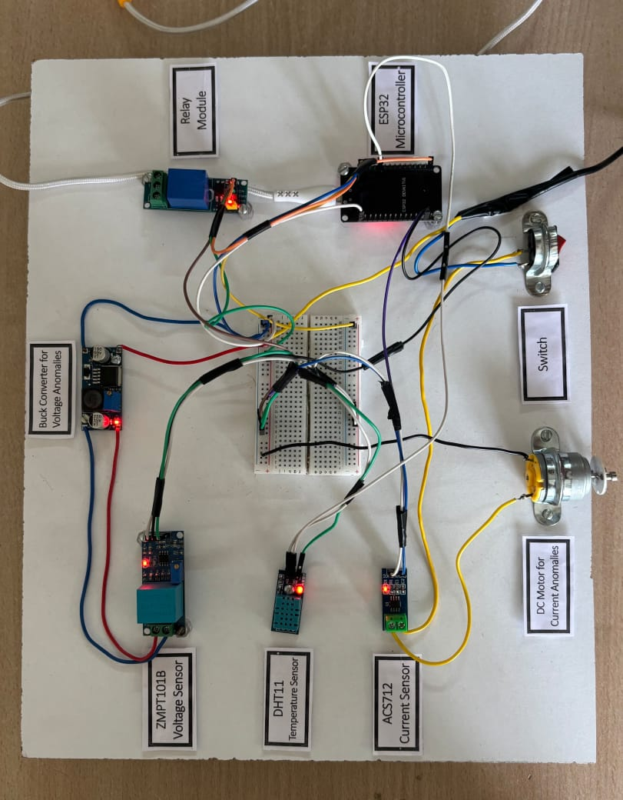

# ⚡ Smart Transformer Monitoring System

This project implements a **Smart Transformer Monitoring System** using **ESP32**, **low-cost electrical sensors**, **OPC UA**, and **Python** to monitor transformer health parameters such as **voltage, current, and temperature** in real time.

The system is designed as a **cost-effective, IoT-based alternative** to traditional SCADA-based transformer monitoring solutions and demonstrates how predictive maintenance can be achieved using open-source tools.

---

## 📌 Problem Statement

Transformer failures due to **overload**, **overheating**, and **voltage abnormalities** result in high repair costs and downtime. Traditional monitoring systems are expensive and not feasible for small-scale or educational deployments.

This project addresses the problem by providing a **low-cost, scalable monitoring system** capable of real-time data acquisition, anomaly detection, and visualization.

---

## 🏗️ System Overview

Sensors → ESP32 → USB Serial (COM Port) → Python OPC UA Server → Dashboard / Client

---

## 🔌 Hardware Components

- ESP32 Development Board  
- ZMPT101B – Voltage Sensor  
- ACS712 – Current Sensor  
- DHT11 – Temperature Sensor  

> ⚠️ These sensors are used for prototype and academic demonstration purposes.

---

## 💻 Software Stack

- Arduino IDE  
- Python  
- freeopcua  
- PySerial  
- Flask (for dashboard)

---

## 📂 Repository Structure

smart-transformer-monitoring/
├── final24.ino  
├── SAMPLE.py  
├── smart-transformer.py  
└── README.md  

---

## 📁 File Description

### final24.ino
ESP32 firmware for reading voltage, current, and temperature sensors and sending data via Serial.

### SAMPLE.py
Reads ESP32 serial data (COM port), updates OPC UA nodes, and exposes industrial data.

### smart-transformer.py
Alternative OPC UA server with TCP and mock data support.

---

## ⚠️ Anomaly Detection

| Parameter | Normal | Warning | Critical |
|--------|--------|---------|---------|
| Voltage | 30–45V | >45V | >55V |
| Current | 0–4A | >4A | >5A |
| Temperature | 20–40°C | >45°C | >55°C |

---

## 💰 Cost Effectiveness

This solution reduces transformer monitoring cost by **over 90%** compared to SCADA-based systems, making it suitable for educational and small industrial use.

---

## 🔮 Future Enhancements

- Flask dashboard  
- ML-based anomaly detection  
- Historical data logging  
- Cloud integration  

---

## 👨‍💻 Author

Varun S 
ESP32 | IoT | OPC UA | Data Analytics

---

## 📸 Hardware Setup

## 📜 License

Open-source project for educational and research purposes.
